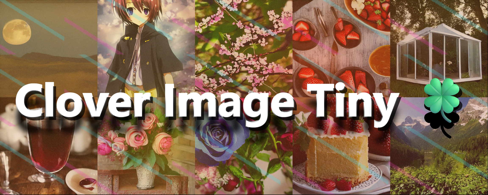
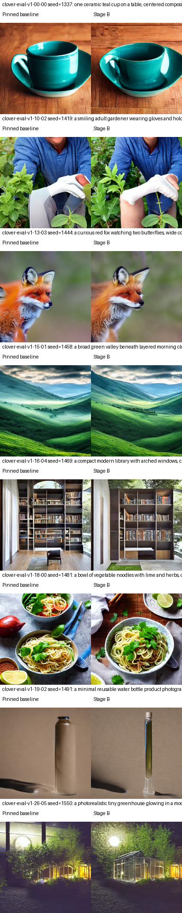

<h1 align="center">Clover Image Tiny</h1>

<p align="center"></p>

<p align="center">
  <strong>512 × 512 text-to-image generation with a 323.4M-parameter denoiser.</strong><br>
  Based on BK-SDM-Tiny, with additional distillation. Diffusers, optional LoRA styles, and separate Core ML releases.
</p>

<p align="center">
<a href="https://huggingface.co/neonforestmist/Clover-Image-Tiny"></a>
<a href="https://huggingface.co/neonforestmist/Clover-Image-Tiny-Inpaint"></a>
<a href="https://huggingface.co/spaces/neonforestmist/Clover-Image-Tiny-Demo"></a>
</p>

<p align="center">
<a href="https://huggingface.co/spaces/neonforestmist/Clover-Image-Tiny-Demo"></a>
<a href="https://github.com/neonforestmist/Clover-Image-Tiny-iOS"></a>
<a href="https://github.com/neonforestmist/clover-image-tiny-lora-trainer"></a>
</p>

<p align="center">
<a href="https://github.com/neonforestmist/Clover-Image-Tiny"></a>
<a href="https://github.com/neonforestmist/Clover-Image-Tiny/actions/workflows/quality.yml"></a>
<a href="https://github.com/neonforestmist/Clover-Image-Tiny/blob/main/LICENSE"></a>
</p>

<p align="center"><a href="#choose-your-model">Models</a> · <a href="#examples">Examples</a> · <a href="#styles">Styles</a> · <a href="https://github.com/neonforestmist/Clover-Image-Tiny#run-clover-locally">Run it</a> · <a href="https://huggingface.co/neonforestmist/Clover-Image-Tiny/blob/main/docs/MODEL_DETAILS.md">Evaluation &amp; documentation</a></p>

---

## Choose your model

Use the regular model to generate an image from text. Use Inpaint HQ to edit a masked
region of an existing image. Both run locally after the model and dependencies are downloaded.

| Clover Image Tiny | Clover Inpaint HQ |
|:---:|:---:|
|  |  |
| **Text → image.** Compact BK-SDM-Tiny architecture with a 323.4M-parameter U-Net and an additional Clover distillation pass. | **Image + mask + text → edit.** Full SD 1.5 inpainting U-Net with Clover's shared components. Larger than the regular model. |
| [Model and weights](https://huggingface.co/neonforestmist/Clover-Image-Tiny) | [Model and weights](https://huggingface.co/neonforestmist/Clover-Image-Tiny-Inpaint) |

The regular Diffusers package is about **1.67 GB**, including its text encoder, VAE,
and safety checker. The 323.4M count describes the denoiser, not the complete pipeline.
Inpainting uses a separate checkpoint; neither download includes the Python environment.

## Examples

Selected outputs from the regular model, with their original prompts.

| Moonlit greenhouse | Blue flowers | Stained-glass night |
|:---:|:---:|:---:|
|  |  |  |
| “a tiny glass greenhouse glowing in a moonlit garden” | “A bouquet of blue flowers” | “A stain glass window of a starry night” |

## Inpainting example

Inpainting regenerates the white area of a mask. Black marks the area to preserve.
This published before-and-after example uses the prompt **“add blue sunglasses.”**

| Before | After the masked edit |
|:---:|:---:|
|  |  |

[**Explore Clover Inpaint HQ →**](https://huggingface.co/neonforestmist/Clover-Image-Tiny-Inpaint) · [**Try generation and inpainting →**](https://huggingface.co/spaces/neonforestmist/Clover-Image-Tiny-Demo)

Inpaint HQ pairs the full Stable Diffusion 1.5 inpainting denoiser with Clover's shared
components. It is a larger, separate model focused on editing quality. For exact preservation,
composite the result through the original binary mask.

## Styles

Optional LoRA adapters change the model's visual style. Below is the same greenhouse
prompt with the base model, Monet, Pointillism, and Watercolor Anime.

| Clover | Monet | Pointillism | Watercolor Anime |
|:---:|:---:|:---:|:---:|
|  |  |  |  |
| [Base model](https://huggingface.co/neonforestmist/Clover-Image-Tiny) | [Get Monet](https://huggingface.co/neonforestmist/clover-image-tiny-monet-lora) | [Get Pointillism](https://huggingface.co/neonforestmist/clover-image-tiny-pointillism-lora) | [Get Watercolor Anime](https://huggingface.co/neonforestmist/clover-image-tiny-watercolor-anime-lora) |

## Run Clover locally

Use **Python 3.11 or 3.12**. On macOS or Linux:

```bash
git clone https://github.com/neonforestmist/Clover-Image-Tiny.git
cd Clover-Image-Tiny
python3.11 -m venv .venv
source .venv/bin/activate
python -m pip install -r requirements.txt
python app.py --device auto
```

Open **http://127.0.0.1:7860** and enter a prompt. The local web app supports regular
generation and optional styles. For masked editing, use the [hosted demo](https://huggingface.co/spaces/neonforestmist/Clover-Image-Tiny-Demo),
[native app](https://github.com/neonforestmist/Clover-Image-Tiny-iOS), or [Inpaint HQ Python example](https://huggingface.co/neonforestmist/Clover-Image-Tiny-Inpaint#run-an-edit-with-python).

The first generation downloads about **1.67 GB** of model files. Later runs reuse the
Hugging Face cache. Allow extra room for the Python environment and caches. Use
`--local-files-only` after setup to work offline.

<details>
<summary>Windows setup</summary>

```powershell
git clone https://github.com/neonforestmist/Clover-Image-Tiny.git
cd Clover-Image-Tiny
py -3.11 -m venv .venv
.venv\Scripts\Activate.ps1
python -m pip install -r requirements.txt
python app.py --device auto
```

</details>

<details>
<summary>Prefer the command line?</summary>

```bash
python generate.py \
  --prompt "a tiny glass greenhouse glowing in a moonlit garden" \
  --negative-prompt "blurry, distorted, low detail" \
  --device auto --steps 50 --guidance-scale 7.5 \
  --scheduler pndm --seed 1337 --output clover.png
```

The runner saves a PNG and a JSON record of settings, seed, and safety results.
Existing planned outputs are never overwritten.

</details>

[**Full setup, controls, and offline instructions →**](docs/USAGE.md)

## Interfaces

| Your workflow | Start here |
|---|---|
| Try it in your browser | [Hosted demo: generation and inpainting](https://huggingface.co/spaces/neonforestmist/Clover-Image-Tiny-Demo) |
| Generate locally with a visual interface | [GitHub setup and Gradio app](https://github.com/neonforestmist/Clover-Image-Tiny#run-clover-locally) |
| Build with Python and Diffusers | [Model weights](https://huggingface.co/neonforestmist/Clover-Image-Tiny) · [Local runner](https://github.com/neonforestmist/Clover-Image-Tiny/blob/main/generate.py) |
| Create on iPhone or iPad | [Native Clover app](https://github.com/neonforestmist/Clover-Image-Tiny-iOS) · [Core ML resources](https://huggingface.co/neonforestmist/Clover-Image-Tiny-CoreML) |
| Train a personal style | [Visual LoRA trainer](https://github.com/neonforestmist/clover-image-tiny-lora-trainer) |

The hosted demo runs remotely. Local Python and Core ML workflows run on your hardware
after setup; model downloads require a network connection.

## Model facts

| Regular Clover model | What it means |
|---|---|
| **323.4M denoiser parameters** | BK-SDM-Tiny architecture; denoiser count only |
| **About 1.67 GB of model files** | Includes the text encoder, VAE, and packaged safety checker; allow extra space for dependencies and caches |
| **512 × 512 native output** | Native output resolution |
| **Diffusers + separate Core ML exports** | Python integration and a path to on-device Apple apps |

On one NVIDIA A10G benchmark, Clover averaged **1.024 seconds per image** across
16 prompts at 512 × 512, 30 DDIM steps, and guidance 7.5. That is a specific measured
GPU result, not an iPhone timing or a speed guarantee. [See the comparison and protocol](https://huggingface.co/neonforestmist/Clover-Image-Tiny/blob/main/benchmarks/text-to-image/results/clover-small-model-comparison-20260825/REPORT.md).

## Usage notes

**Can I use Clover offline?** Yes. Download the model and dependencies first, then use
`--local-files-only` with the local runner. No hosted generation service is required.

**Does it work on a Mac?** The Python path supports Apple silicon through PyTorch MPS.
NVIDIA systems use CUDA; CPU inference is also supported, but slower.

**Is normal Clover the same as Inpaint HQ?** They are separate checkpoints. Normal Clover
creates images from text. Inpaint HQ takes an image, a mask, and a prompt, and uses a larger denoiser.

**What are its limits?** Hands, faces, readable text, precise counts, and complex relationships
can be unreliable. Examples are selected outputs; results vary with prompts and settings.
The packaged safety checker in the Python runner and hosted demo is imperfect.

## Explore the project

[Model weights and card](https://huggingface.co/neonforestmist/Clover-Image-Tiny) · [Inpaint HQ](https://huggingface.co/neonforestmist/Clover-Image-Tiny-Inpaint) ·
[Core ML downloads](https://huggingface.co/neonforestmist/Clover-Image-Tiny-CoreML) · [Complete ecosystem](docs/ECOSYSTEM.md) ·
[Training and benchmark details](https://huggingface.co/neonforestmist/Clover-Image-Tiny/blob/main/docs/MODEL_DETAILS.md)

This repository contains the local Gradio app, Diffusers command-line runner, pinned
dependencies, and documentation. Model weights download from Hugging Face.

Source code: [Apache-2.0](LICENSE). Model and style weights: **CreativeML Open RAIL-M**;
see the [model's license ledger](https://huggingface.co/neonforestmist/Clover-Image-Tiny/blob/main/MODEL_DATA_LICENSES.md).
The code license does not replace the terms for downloaded weights.

## Full example gallery

<p align="center"></p>

## Clover ecosystem

This repository is the central directory, while large artifacts remain on
Hugging Face and platform-specific source remains in focused GitHub projects.

| Project | Purpose |
|---|---|
| [Clover Image Tiny on Hugging Face](https://huggingface.co/neonforestmist/Clover-Image-Tiny) | Model weights, model card, provenance, and exact checkpoint files |
| [Clover Image Tiny Demo](https://huggingface.co/spaces/neonforestmist/Clover-Image-Tiny-Demo) | Hosted ZeroGPU generation with named styles |
| [Clover Image Tiny iOS](https://github.com/neonforestmist/Clover-Image-Tiny-iOS) | SwiftUI/Core ML iPhone app and model downloader |
| [Clover Image Tiny Inpaint](https://huggingface.co/neonforestmist/Clover-Image-Tiny-Inpaint) | 9-channel Diffusers inpainting checkpoint, examples, and citation |
| [Clover Image Tiny Inpaint Core ML](https://huggingface.co/neonforestmist/Clover-Image-Tiny-Inpaint-CoreML) | Separate compiled inpainting resources |
| [Clover Image Tiny LoRA Trainer](https://github.com/neonforestmist/clover-image-tiny-lora-trainer) | Visual training studio and stateful Core ML exporter |
| [Clover Image Tiny Core ML](https://huggingface.co/neonforestmist/Clover-Image-Tiny-CoreML) | Shared downloadable Core ML pipeline |

The full style and dataset directory is in [`docs/ECOSYSTEM.md`](docs/ECOSYSTEM.md).


## Detailed documentation

<details>
<summary>Complete installation instructions and generation controls</summary>

## 2. Install

Python 3.11 or 3.12 is recommended. Install the PyTorch build suited to your
platform, then install the pinned application dependencies.

### 2.1 macOS or Linux

```bash
git clone https://github.com/neonforestmist/Clover-Image-Tiny.git
cd Clover-Image-Tiny

python3.11 -m venv .venv
source .venv/bin/activate
python -m pip install --upgrade pip
python -m pip install -r requirements.txt
```

### 2.2 Windows PowerShell

```powershell
git clone https://github.com/neonforestmist/Clover-Image-Tiny.git
cd Clover-Image-Tiny

py -3.11 -m venv .venv
.venv\Scripts\Activate.ps1
python -m pip install --upgrade pip
python -m pip install -r requirements.txt
```

Keep room for the 1.67 GB model, the Python environment, and the Hugging Face
cache. CUDA uses an NVIDIA GPU, MPS uses Apple Silicon, and CPU works more
slowly in float32.

## 3. Local web app

```bash
python app.py --device auto
```

Open `http://127.0.0.1:7860`. The app exposes:

- prompt and negative prompt;
- Clover, Monet, Pointillism, and Watercolor Anime styles;
- 4–100 inference steps and guidance from 0–20;
- seed, width, height, and five schedulers;
- CUDA, Apple MPS, or CPU selection;
- generation metadata and packaged safety-checker results.

The model loads only when the first image is requested. A selected style LoRA
also downloads only when it is first used. To require previously cached files
and prevent network access, launch with `--local-files-only`.

## 4. Command-line example

```bash
python generate.py \
  --prompt "a tiny glass greenhouse glowing in a moonlit garden" \
  --negative-prompt "blurry, distorted, low detail" \
  --device auto \
  --steps 50 \
  --guidance-scale 7.5 \
  --scheduler pndm \
  --seed 1337 \
  --output clover-image-tiny.png
```

The runner defaults to `neonforestmist/Clover-Image-Tiny`; pass `--model` only
to use another Hub ID or a downloaded local folder. Every run writes a PNG and
a JSON sidecar containing resolved settings, seeds, checksums, runtime details,
and the safety result. Existing planned outputs are never overwritten.

### 4.1 Offline after the first download

```bash
python generate.py \
  --local-files-only \
  --prompt "a quiet library with arched windows" \
  --output library.png
```

## 5. Generation controls

| Flag | Range or choices | Default |
|---|---|---|
| `--steps` | 4–100 | `50` |
| `--guidance-scale` | 0–20 | `7.5` |
| `--scheduler` | `pndm`, `ddim`, `euler`, `euler-a`, `dpmpp-2m` | `pndm` |
| `--width`, `--height` | 256–768, multiples of 64 | `512` |
| `--num-images` | 1–4 | `1` |
| `--seed` | 0–2⁶³−1 | `1337` |
| `--device` | `auto`, `cuda`, `mps`, `cpu` | `auto` |

The validated reference recipe is 50-step PNDM, guidance 7.5, 512×512, and
one image. More steps take longer and do not guarantee a better result.

</details>

<details>
<summary>Repository contents and safety information</summary>

### Repository contents

```text
Clover-Image-Tiny/
├── app.py                    # local Gradio interface
├── generate.py               # reproducible Diffusers command-line runner
├── requirements.txt          # pinned Python dependencies
├── docs/ECOSYSTEM.md         # every model, app, style, and dataset link
├── assets/                   # documentation images only
└── .github/workflows/        # lightweight source checks
```

Model checkpoints, LoRAs, compiled Core ML packages, generated outputs, and
local caches are excluded by `.gitignore`.

### Safety and limitations

The packaged Stable Diffusion safety checker remains enabled in both runnable
examples. It can miss harmful material or over-filter benign content, so
applications still need controls appropriate to their audience.

Hands, anatomy, exact counts and relationships, and readable text can be
difficult. Results vary by prompt, seed, scheduler, device, and precision.
Do not use outputs for consequential decisions or identity claims.

</details>

## Citation

If you use Clover Image Tiny in your work, please cite the model release:

```bibtex
@software{lozadaperez2026cloverimagetiny,
  author = {Lukas Lozada Perez},
  title = {Clover Image Tiny: Compact Local Text-to-Image Diffusion},
  year = {2026},
  url = {https://huggingface.co/neonforestmist/Clover-Image-Tiny}
}
```

Created by **Lukas Lozada Perez**.
